# COCOLOFA-RU v2: русский корпус логических ошибок и encoder-baselines

Репозиторий содержит репродукционные артефакты по сборке и анализу русскоязычного корпуса **COCOLOFA-RU v2** для задачи детекции логических ошибок в аргументативных текстах. В составе репозитория находятся:

- переведённый и маскированный датасеты;
- публичные notebooks для маскирования, Phase 1 baseline-экспериментов и post-hoc анализа;
- ключевые графики и агрегированные метрики;
- ссылки и публикационные метаданные для интерактивных BertViz attention-артефактов.

## Данные

- Переведённый корпус: [data/cocolofa_ru_v2.jsonl](data/cocolofa_ru_v2.jsonl)
- Маскированный корпус: [data/cocolofa_ru_v2_masked.jsonl](data/cocolofa_ru_v2_masked.jsonl)

Краткие характеристики:

- полный переведённый корпус: `7706` записей;
- автоматически принятый подкорпус для обучения: `7591` записей (`ok + repaired_ok`);
- split для обучения: `5300 / 1508 / 783` (`train / dev / test`);
- число классов: `9`.

Инвентарь меток:

`none`, `appeal to authority`, `appeal to majority`, `appeal to nature`, `appeal to tradition`, `appeal to worse problems`, `false dilemma`, `hasty generalization`, `slippery slope`.

## Ноутбуки

- [01_masking.ipynb](notebooks/01_masking.ipynb) — генерация маскированного корпуса.
- [02_phase1_encoder_baselines.ipynb](notebooks/02_phase1_encoder_baselines.ipynb) — запуск Phase 1 encoder-baselines.
- [03_phase1_results_analysis.ipynb](notebooks/03_phase1_results_analysis.ipynb) — анализ уже обученных run-ов и агрегированных метрик.

Рекомендуемый сценарий воспроизведения:

1. выполнить [01_masking.ipynb](notebooks/01_masking.ipynb) для построения маскированной версии корпуса;
2. выполнить [02_phase1_encoder_baselines.ipynb](notebooks/02_phase1_encoder_baselines.ipynb) для обучения encoder-baselines;
3. выполнить [03_phase1_results_analysis.ipynb](notebooks/03_phase1_results_analysis.ipynb) для агрегации метрик и построения визуальной аналитики.

## Результаты Phase 1

Агрегированная таблица по трём seed (`42, 52, 62`) на accepted subset:

| Конфигурация | Macro-F1 | ROC-AUC macro OVR |
| --- | ---: | ---: |
| `XLM-R + text_ru` | `0.7676 ± 0.0093` | `0.9481 ± 0.0042` |
| `XLM-R + text_masked` | `0.7666 ± 0.0073` | `0.9480 ± 0.0056` |
| `RuBERT + text_masked` | `0.7422 ± 0.0109` | `0.9392 ± 0.0024` |
| `RuBERT + text_ru` | `0.7411 ± 0.0083` | `0.9435 ± 0.0024` |

Публикационные акценты:

- лучший **mean baseline**: `XLM-R + text_ru`;
- лучший **single run**: `XLM-R + text_masked`, `seed=62`;
- метрики лучшего single run: `macro-F1 = 0.7751`, `macro-precision = 0.7681`, `macro-recall = 0.7878`, `ROC-AUC macro OVR = 0.9542`.

Итоговые агрегаты лежат в:

- [summary_metrics.json](artifacts/summary/summary_metrics.json)
- [summary_table.md](artifacts/summary/summary_table.md)
- [completed_runs.json](artifacts/summary/completed_runs.json)

## Визуальная аналитика

| Распределение классов | Длины текстов |
| --- | --- |
| 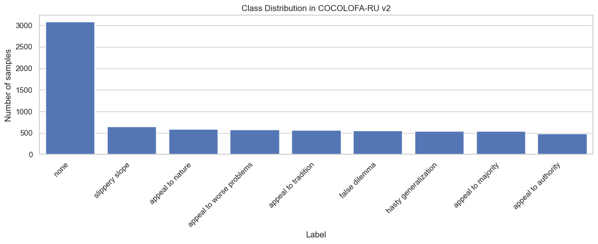 | 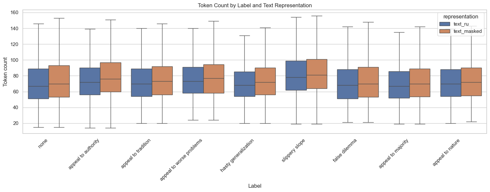 |

| Частотные слова по классам | Per-class F1 |
| --- | --- |
| 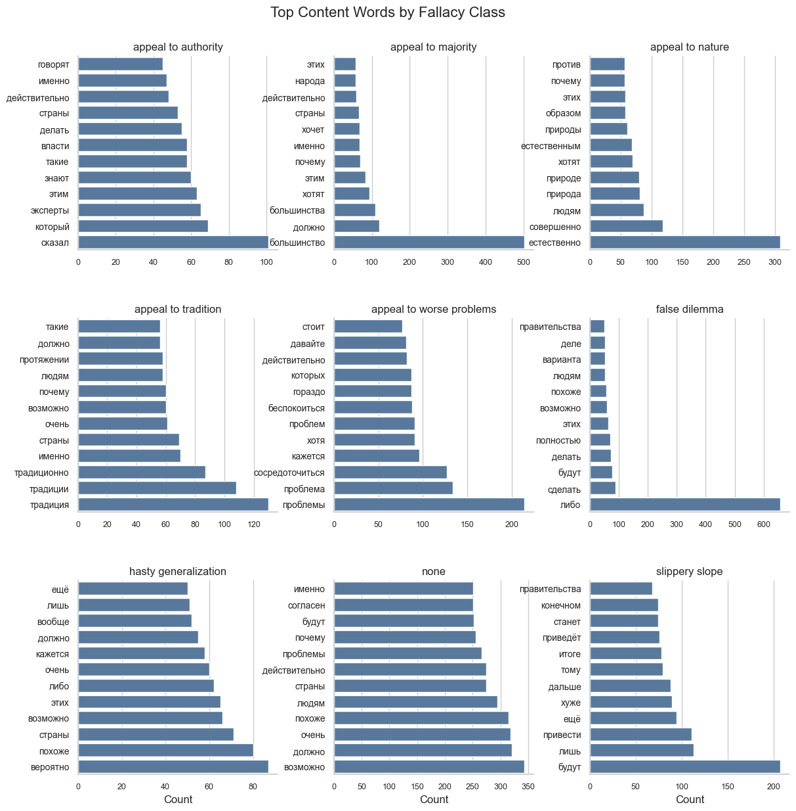 | 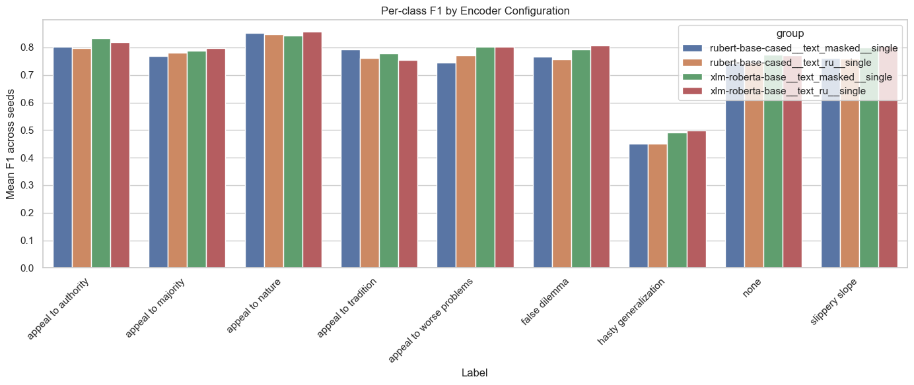 |

| Confusion matrix | ROC-AUC |
| --- | --- |
| 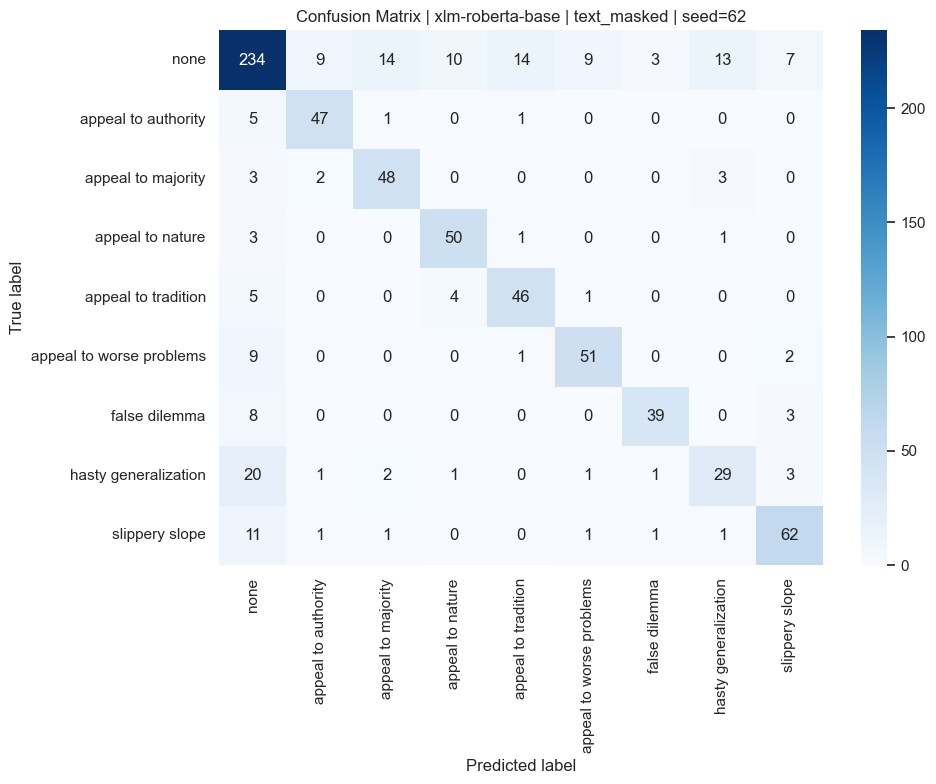 | 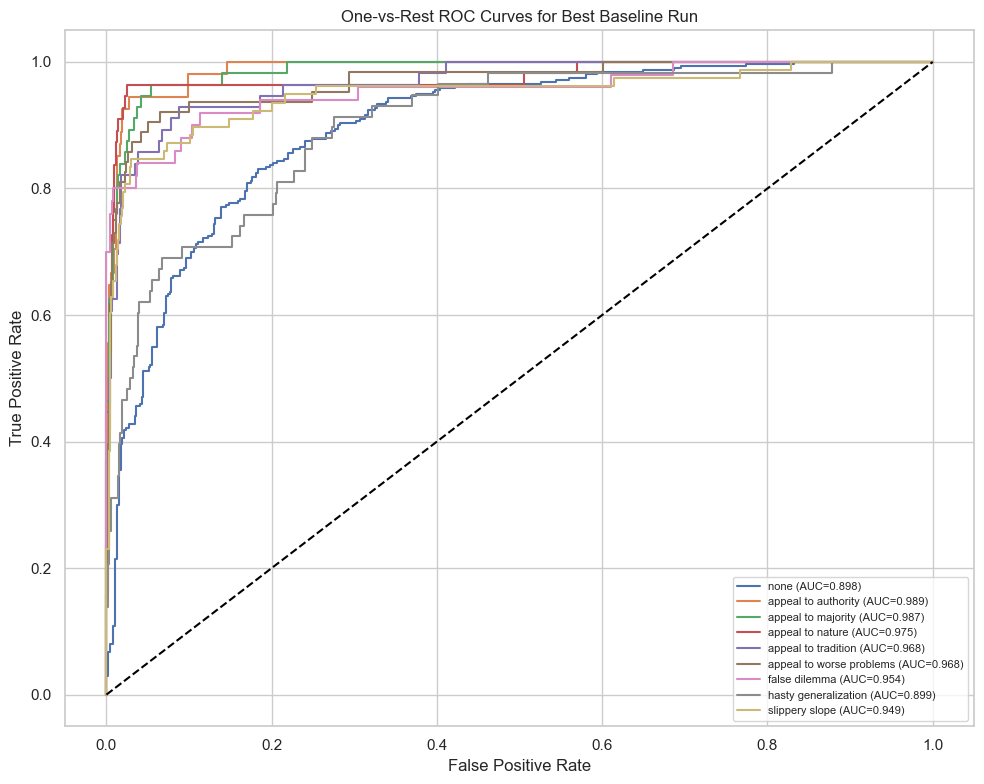 |

Дополнительные артефакты:

- 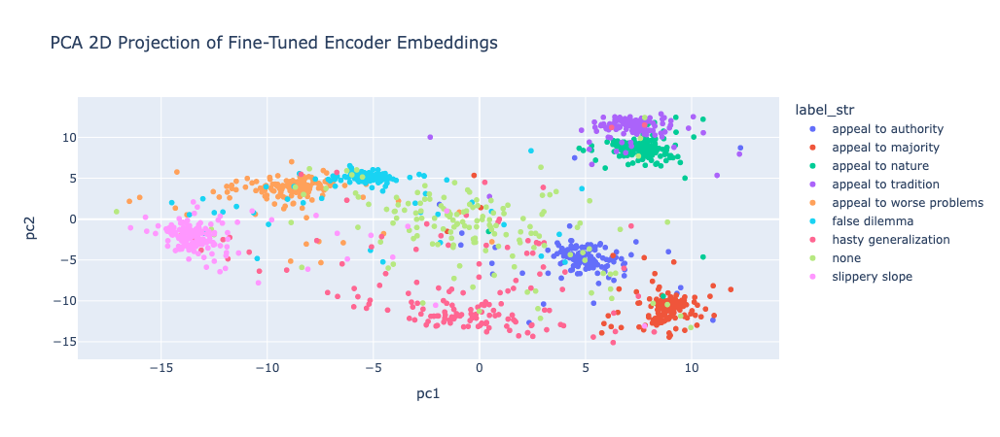
- 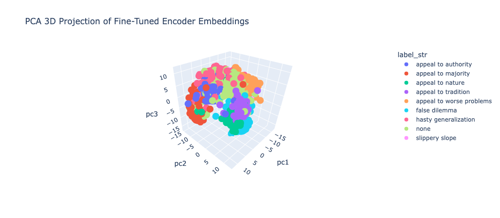
- 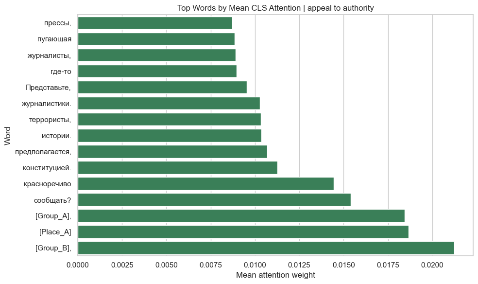

Примеры маскирования сущностей:

| Пример 1 | Пример 2 |
| --- | --- |
| 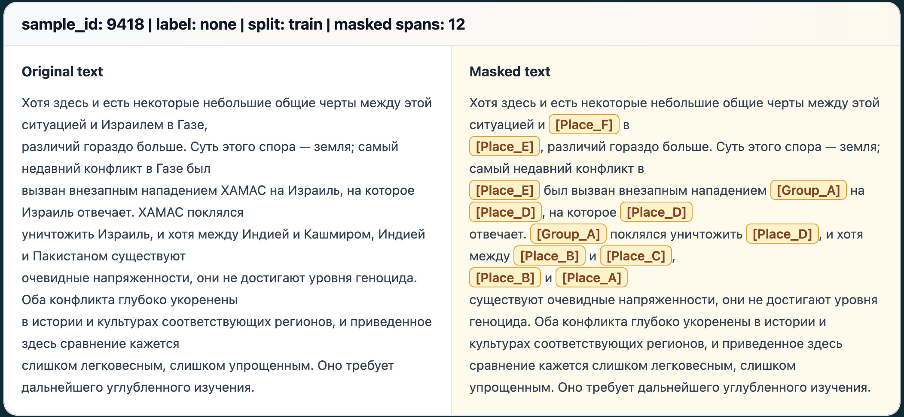 | 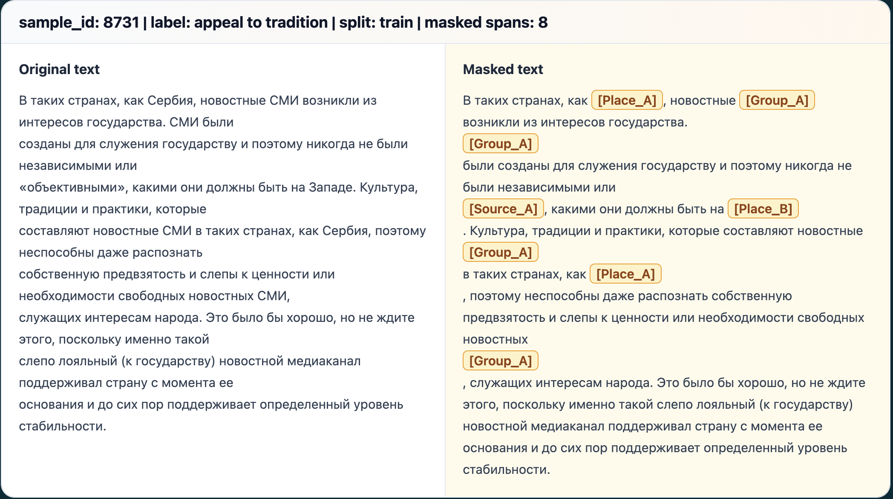 |

## Полные артефакты

Полный каталог `results` с весами моделей, run-артефактами и дополнительными HTML/PNG-материалами опубликован отдельно на Google Drive:

- [Google Drive: full results folder](https://drive.google.com/drive/folders/1yBxYgh-2wmf-Rh3tna9Bm6JNWAO8Qdq5?usp=sharing)

В репозитории сохранены только компактные производные артефакты, необходимые для чтения результатов:

- [summary_metrics.json](artifacts/summary/summary_metrics.json)
- [summary_table.md](artifacts/summary/summary_table.md)
- [completed_runs.json](artifacts/summary/completed_runs.json)
